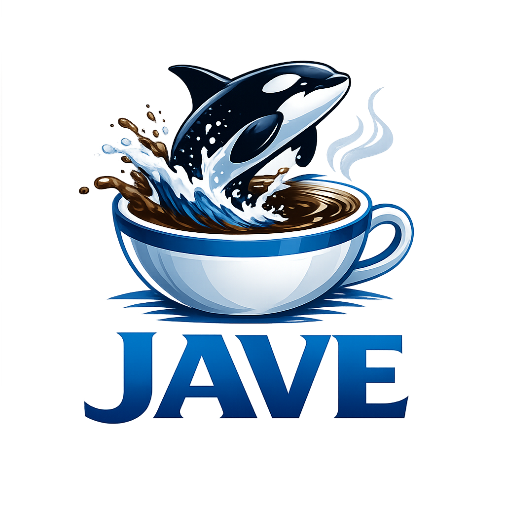

# Jave

[](https://go.dev/)
[](https://github.com/asciifaceman/jave/releases)
[](LICENSE)

<p align="center">
    
</p>

Jave is a deliberately committee-damaged programming language.

It is a joke language with real behavior: the syntax is cursed on purpose, but programs produce deterministic, testable outcomes.

License model: custom parody-forward project license, see [LICENSE](LICENSE).

## Table Of Contents

- [Project Snapshot](#project-snapshot)
- [Install And Run](#install-and-run)
- [Release Assets](#release-assets)
- [VS Code Plugin](#vs-code-plugin)
- [Hello Jave](#hello-jave)
- [Architecture](#architecture)
- [Docs And Governance](#docs-and-governance)
- [Developer Workflow](#developer-workflow)
- [Contributing](#contributing)

## Project Snapshot

| Area | Current State |
| --- | --- |
| Language Spec | v0.1 locked and implemented |
| Toolchain | `javec`, `baggage`, `javevm`, `javels` |
| Platforms | Windows, Linux, macOS |
| Editor Support | VS Code syntax + bundled LSP hover/signature preview |
| Governance | v0.1 records complete, v0.2 candidates drafted |

Current focus:
- publish polished v0.1 release assets
- move v0.2 candidates toward ratified design
- expand runtime I/O and standard library surface

## Install And Run

### Install from source

```bash
go install github.com/asciifaceman/jave/cmd/javec@latest
go install github.com/asciifaceman/jave/cmd/baggage@latest
go install github.com/asciifaceman/jave/cmd/javevm@latest
go install github.com/asciifaceman/jave/cmd/javels@latest
```

### Verify toolchain

```bash
javec --version
baggage --version
javevm --version
javels --version
```

### Compile and run

```bash
javec hello.jave
baggage run hello.jave
```

## Release Assets

When a tag is published, GitHub Actions attaches release assets for:
- `linux-amd64`
- `windows-amd64`
- `darwin-amd64`

Binary assets include:
- `javec-<tag>-<os>-amd64[.exe]`
- `baggage-<tag>-<os>-amd64[.exe]`
- `javevm-<tag>-<os>-amd64[.exe]`
- `jave-vscode-install-<tag>-<os>-amd64[.exe]`
- `jave-vscode-extension-<tag>.tar.gz` and `.zip`
- `SHA256SUMS.txt`

Release prep details: [docs/releases/v0.1.0-release-prep.md](docs/releases/v0.1.0-release-prep.md)

## VS Code Plugin

Quick install options:

```bash
mage installExtension
```

or

```bash
go run ./tools/install-extension
```

Plugin docs:
- [vscode-jave/README.md](vscode-jave/README.md)
- [docs/vscode-extension-install.md](docs/vscode-extension-install.md)

## Hello Jave

```jave
outy seq Foremost<> --> <<nada>> {
    Pront("hello, jave");;
    give up;;
}
```

More runnable programs:
- [examples/](examples)
- [examples/incident_triage/main.jave](examples/incident_triage/main.jave)
- [examples/adv-log-anomaly-triage/main.jave](examples/adv-log-anomaly-triage/main.jave)
- [examples/adv-game-lobby-balancer/main.jave](examples/adv-game-lobby-balancer/main.jave)
- [examples/adv-map-spawn-selector/main.jave](examples/adv-map-spawn-selector/main.jave)
- [examples/adv-cli-runtime-contract/main.jave](examples/adv-cli-runtime-contract/main.jave)
- [examples/adv-dossier-journal/main.jave](examples/adv-dossier-journal/main.jave)
- [examples/adv-embellishments-incident-board/main.jave](examples/adv-embellishments-incident-board/main.jave)

## Architecture

Pipeline:

`lexer -> parser -> semantic analysis -> lowering -> jbin -> runtime`

Project layout:

```text
cmd/            CLI tools: javec, baggage, javevm
internal/       Compiler/runtime implementation
docs/           Documentation and release prep
examples/       Runnable language samples
specs/          Versioned language specs
governance/     Governance records and release provenance
vscode-jave/    VS Code syntax highlighting package
.github/        Workflows, instructions, and project automation
```

## Docs And Governance

Core docs:
- [specs/jave-v0.1.md](specs/jave-v0.1.md)
- [docs/syntax.md](docs/syntax.md)
- [docs/how-to-write-jave.md](docs/how-to-write-jave.md)
- [CHANGELOG.md](CHANGELOG.md)

Governance records:
- [governance/README.md](governance/README.md)
- [governance/v0.1/README.md](governance/v0.1/README.md)
- [governance/v0.2/README.md](governance/v0.2/README.md)

## Developer Workflow

Use Mage for common local workflows:

```bash
go install github.com/magefile/mage@latest
mage -l
mage build
mage test
mage check
```

No Mage installed yet:

```bash
go run github.com/magefile/mage -l
```

## Contributing

Contribution priorities:
- parser/runtime correctness
- diagnostics quality
- cross-platform consistency
- governance/spec alignment

Tone can be funny. Behavior must stay trustworthy.
